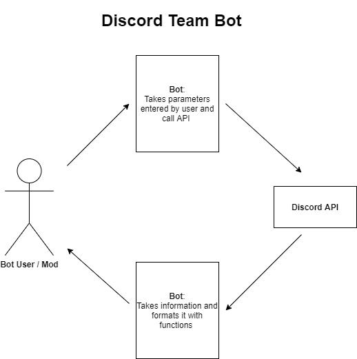

# Discord Team Bot

An automated team assigning bot for Discord

## Project Abstract

Discord has quickly become an application that people use to communicate with others whether it be with their friends specific community and or classmates. Being a CS major, most classes require group/team work to get assignments completed. The project I would like to focus on is a Discord bot that can be called via a typed command (ex: !maketeam). This bot will get members of Discord server and automatically assign members randomly to a team. The team sizes will also be able to be specified with the corresponding number following the command while being able to control how big the teams can be. After the teams are created, the bot should then be able to assign each team a designated text or voice channel. This bot will help students in class or a group of friends playing a team based video game to seamlessly and effortlessly create random groups while completely removing wasted time and possible confusion of having team captains picking their teammates and manually getting everyone in their own group channels. 

## Relevence

This project will tie in different amounts of topics covered in the course such as implementing objective oriented design using Python, Version control and debugging. While working on the past labs and projects, implementing OOD will require extensive testing to make sure that the bot will be able to handle the calls and different situations where the bot should split the teams correctly without any error or complaints. This project will also be creating and using a UML to model how the classes and objects will flow and work with one another.

## Conceptual Design

This is an open source project:  which is a server management tool for Discord. As the name suggests, this tool includes many other bots from a music player, a math expression solver, all the way to a bot that can show the weather forecasts for any location that is inputted by the user. This bot will be able to get members in a Discord lobby/channel, that is queued for team creation and then randomly relocate teams into a newly created channel with other team members with the help of the Discord API to pull servers and members that are called. The created channels will be discarded automatically if all members of the team leave it thus not building up useless channels every time a team is created. 

## Required Resources

Python/Javascript, PC/Laptop, Discord
